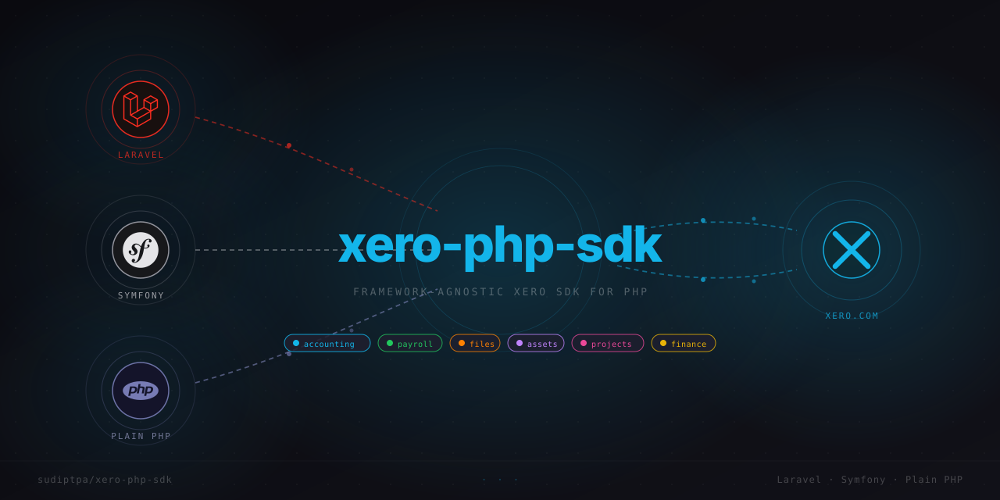

<p align="center">
  
</p>

[](https://www.php.net/)
[](https://github.com/sudiptpa/xero-php-sdk/actions/workflows/ci.yml)
[](https://packagist.org/packages/sudiptpa/xero-php-sdk)
[](https://packagist.org/packages/sudiptpa/xero-php-sdk)
[](https://github.com/sudiptpa/xero-php-sdk/releases)
[](https://github.com/sudiptpa/xero-php-sdk)
[](LICENSE)

---

[](https://github.com/sponsors/sudiptpa)

If this package saves you time, [GitHub Sponsors](https://github.com/sponsors/sudiptpa) is a simple way to support it.

A fluent, framework-agnostic Xero SDK for PHP 8.2 to 8.5. No runtime dependencies. Drop it into Laravel, Symfony, or a plain PHP project; it runs anywhere PHP runs.

- Typed models for every Xero API response
- Fluent builders for reads and writes
- Covers Accounting, Payroll, Files, Assets, Projects, Finance, App Store, Identity, and Webhooks

## Installation

```bash
composer require sudiptpa/xero-php-sdk
```

Requires:

- PHP 8.2 to 8.5
- `ext-json`
- `ext-curl` (for the built-in transport)

If `ext-curl` is not available, supply your own transport (see [Custom transport](#custom-transport)).

## Quick start

```php
use Sujip\Xero\Auth\InMemoryTokenRepository;
use Sujip\Xero\Xero;

$manager = Xero::oauth2(
    clientId: 'client-id',
    clientSecret: 'client-secret',
    redirectUri: 'https://example.com/xero/callback',
)->manager(new InMemoryTokenRepository());

$url = $manager->authorizationUrl(
    scopes: ['openid', 'offline_access', 'accounting.contacts'],
    state: 'csrf-token',
);
```

After Xero redirects back with a code:

```php
$token = $manager->exchange($code);
$tenants = $manager->connections();

$connected = $manager->connectTenant($tenants[0]->getTenantId());

$contacts = $connected->tenant()
    ->accounting()
    ->contacts()
    ->page(1)
    ->get();
```

Call `tenant()` to get a client scoped to that tenant. `getClient()` works too.

If you already know the tenant id:

```php
$connected = $manager->exchangeAndConnect($code, 'tenant-id');
```

## Usage

```php
use Sujip\Xero\Xero;

$xero = Xero::withAccessToken('token')
    ->tenant('tenant-id');

$contacts = $xero->accounting()
    ->contacts()
    ->where('Name.Contains(:name)', name: 'Acme')
    ->orderBy('Name')
    ->page(1)
    ->get();
```

```php
$page = $xero->accounting()
    ->contacts()
    ->paginate(page: 2);
```

```php
use Sujip\Xero\Accounting\Invoice\Invoice;
use Sujip\Xero\Accounting\Contact\Contact;
use Sujip\Xero\Accounting\Invoice\LineItem;

$invoice = $xero->accounting()
    ->invoices()
    ->create()
    ->using(
        (new Invoice())
            ->setType('ACCREC')
            ->setStatus('DRAFT')
            ->setContact(
                (new Contact())
                    ->setContactID('contact-id')
            )
            ->setReference('PO-1001')
            ->addLineItem(
                (new LineItem())
                    ->setDescription('Consulting')
                    ->setQuantity(2)
                    ->setUnitAmount(150)
            )
    )
    ->save();
```

```php
use Sujip\Xero\Accounting\Account\Account;
use Sujip\Xero\Accounting\Payment\Payment;

$payment = $xero->accounting()
    ->payments()
    ->create()
    ->using(
        (new Payment())
            ->setInvoiceID('invoice-id')
            ->setAccount(
                (new Account())
                    ->setAccountID('account-id')
            )
            ->setDate('2026-03-25')
            ->setAmount(150)
            ->setReference('PAY-1001')
    )
    ->save();
```

```php
use Sujip\Xero\Accounting\Contact\Contact;

$updated = $xero->accounting()
    ->contacts()
    ->update('contact-id')
    ->using(
        (new Contact())
            ->setContactID('contact-id')
            ->setName('Acme Holdings Pty Ltd')
    )
    ->save();
```

```php
$attachment = $xero->accounting()
    ->invoices()
    ->attachments('invoice-id')
    ->upload('invoice.pdf', $pdfBinary)
    ->mimeType('application/pdf')
    ->includeOnline()
    ->save();
```

```php
$file = $xero->files()
    ->upload('contract.pdf', $binary)
    ->mimeType('application/pdf')
    ->toFolder('folder-id')
    ->save();

$fileName = $file->getName();
```

```php
$folder = $xero->files()
    ->folders()
    ->inbox();

$isInbox = $folder?->getIsInbox();
```

```php
$files = $xero->files()
    ->forObject('invoice-id')
    ->get();
```

```php
$assets = $xero->assets()
    ->status('registered')
    ->orderBy('AssetName')
    ->filterBy('MacBook')
    ->get();

$assetName = $assets->first()?->getAssetName();
```

```php
$project = $xero->projects()
    ->create()
    ->title('Website rebuild')
    ->contact('contact-id')
    ->estimateAmount(1200)
    ->save();

$projectId = $project->getProjectId();
```

```php
$entries = $xero->projects()
    ->timeEntries('project-id')
    ->user('user-id')
    ->task('task-id')
    ->states('INPROGRESS')
    ->get();
```

```php
$employees = $xero->payroll()
    ->au()
    ->employees()
    ->page(1)
    ->get();
```

```php
$leave = $xero->payroll()
    ->au()
    ->leaveApplications()
    ->create()
    ->employee('employee-id')
    ->leaveType('leave-type-id')
    ->title('Annual Leave')
    ->startDate('2026-04-01')
    ->endDate('2026-04-02')
    ->save();
```

```php
$timesheet = $xero->payroll()
    ->nz()
    ->timesheets()
    ->create()
    ->employee('employee-id')
    ->startDate('2026-03-23')
    ->endDate('2026-03-29')
    ->status('DRAFT')
    ->save();
```

```php
$balances = $xero->payroll()
    ->uk()
    ->employees()
    ->find('employee-id')
    ?->leaveBalances();
```

```php
$balanceSheet = $xero->finance()
    ->statements()
    ->balanceSheet(new DateTimeImmutable('2026-03-31'));
```

```php
$subscription = $xero->appStore()
    ->subscriptions()
    ->find('subscription-id');
```

```php
$connections = Xero::withAccessToken($token)
    ->identity()
    ->connections()
    ->get();
```

```php
$verifier = Xero::webhookVerifier($signingKey);

$verifier->assertValid($rawPayload, $signatureHeader);
$webhook = $verifier->parse($rawPayload);
```

## Custom transport

Implement the `Transport` interface to use a different HTTP client.

```php
use GuzzleHttp\Client as GuzzleClient;
use GuzzleHttp\Exception\GuzzleException;
use Sujip\Xero\Exceptions\TransportException;
use Sujip\Xero\Http\Request;
use Sujip\Xero\Http\Response;
use Sujip\Xero\Http\Transport;
use Sujip\Xero\Xero;

final class GuzzleTransport implements Transport
{
    public function __construct(
        private readonly GuzzleClient $client = new GuzzleClient()
    ) {
    }

    public function send(Request $request): Response
    {
        try {
            $response = $this->client->request($request->method, $request->url(), [
                'headers' => $request->headers,
                'json' => $request->json,
                'body' => $request->body,
            ]);
        } catch (GuzzleException $exception) {
            throw new TransportException($exception->getMessage(), previous: $exception);
        }

        return new Response(
            $response->getStatusCode(),
            array_map(
                static fn (array $values): string => $values[0] ?? '',
                $response->getHeaders()
            ),
            (string) $response->getBody(),
        );
    }
}

$xero = Xero::withAccessToken('token', new GuzzleTransport())
    ->tenant('tenant-id');
```

## Scopes

- Apps created on or after 2 March 2026 must use granular scopes
- Apps created before 2 March 2026 can start requesting granular scopes from April 2026
- All apps must migrate off broad scopes by September 2027
- Request only the scopes the integration actually uses
- Use `.read` scopes for read-only work
- A missing scope returns a `401` insufficient-scope response

## Tenants

Use `identity()->connections()` to list which tenants a token can access. Make tenant-scoped API calls (Accounting, Files, Projects, Assets, Finance, Payroll) only after calling `tenant(...)`.

## Auth flow

```php
use Sujip\Xero\Auth\InMemoryTokenRepository;
use Sujip\Xero\Xero;

$manager = Xero::oauth2(
    clientId: 'client-id',
    clientSecret: 'client-secret',
    redirectUri: 'https://example.com/xero/callback',
)->manager(new InMemoryTokenRepository());

$url = $manager->authorizationUrl(
    scopes: ['openid', 'offline_access', 'accounting.contacts'],
    state: 'csrf-token',
);
```

After callback:

```php
$manager->exchange($code);
$connected = $manager->connectTenant('tenant-id');

$xero = $connected->tenant();
```

See [Auth](docs/auth.md) for PKCE, token refresh, tenant selection, and custom connection flows.

## Supported APIs

- Accounting
- Files
- Assets
- Projects
- Payroll AU
- Payroll NZ
- Payroll UK
- Finance
- App Store
- Identity
- Webhooks

## Documentation

- [Architecture](docs/architecture.md)
- [Auth](docs/auth.md)
- [Accounting](docs/accounting.md)
- [Files](docs/files.md)
- [Assets](docs/assets.md)
- [Projects](docs/projects.md)
- [Payroll AU](docs/payroll-au.md)
- [Payroll NZ](docs/payroll-nz.md)
- [Payroll UK](docs/payroll-uk.md)
- [Finance](docs/finance.md)
- [App Store](docs/app-store.md)
- [Webhooks](docs/webhooks.md)

## Contributing

See [Contributing](CONTRIBUTING.md) and [Changelog](CHANGELOG.md).
